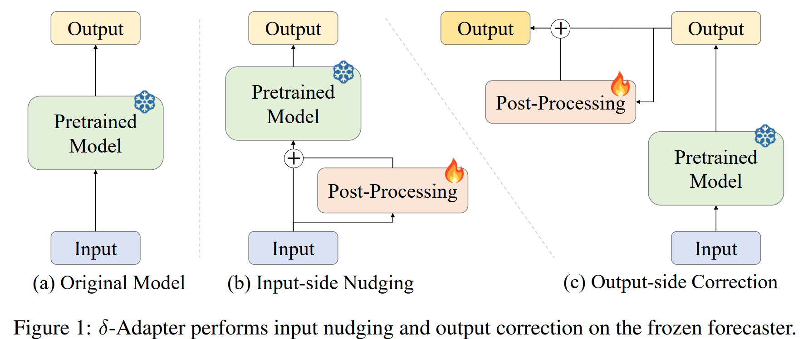
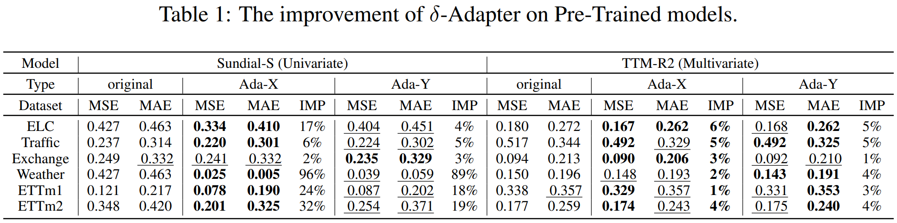
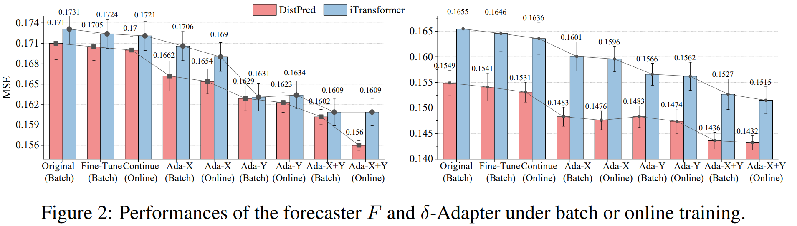
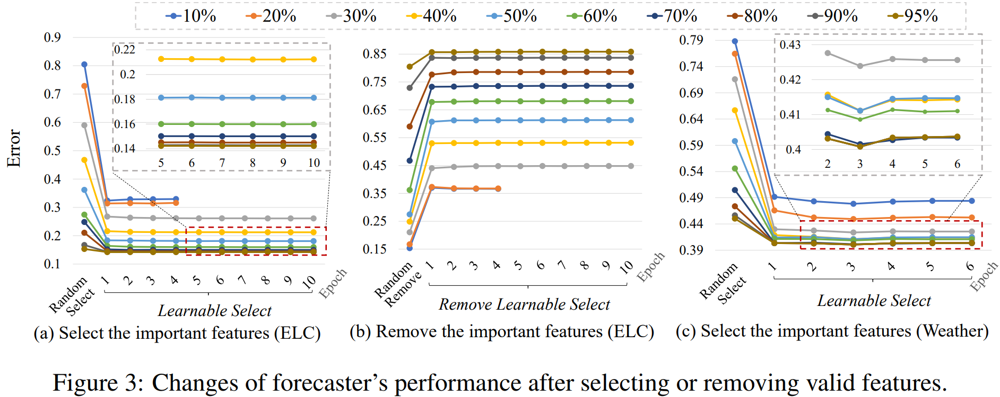
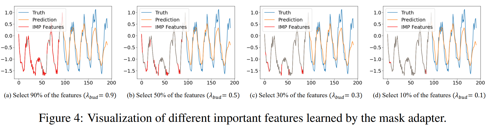
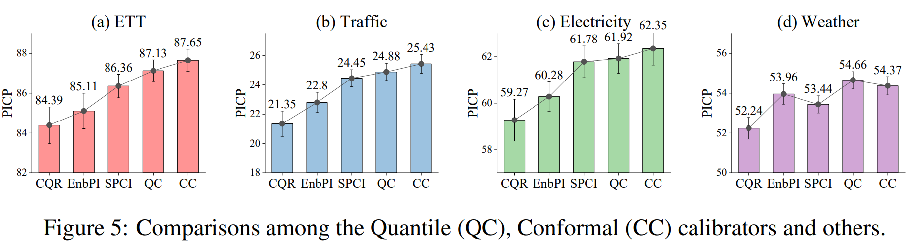
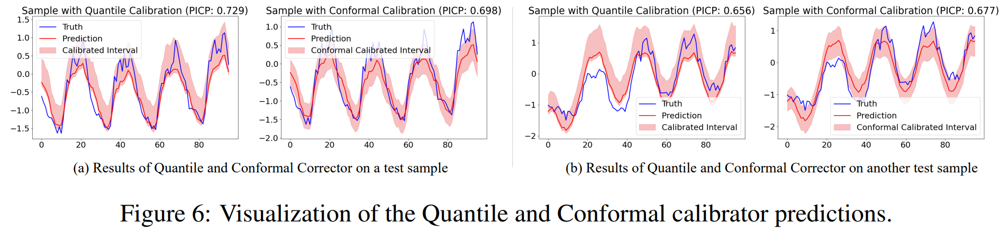

# $\delta$-Adapter (ICLR-26 Accepted! 🎉🎉🎉)
### Title: The Forecast After the Forecast: A Post-Processing Shift in Time Series
### link: https://iclr.cc/virtual/2026/poster/10007022
### Arxiv: https://arxiv.org/abs/2601.20280
### openreview: https://openreview.net/forum?id=syfWdclGE1
### WeChat: 
### Zhihu: 
### CSDN:

## 1. TL;DR: ✨

We propose post-hoc, a lightweight, architecture-agnostic way to boost deployed time series forecasters without retraining.


## Citation

```
@inproceedings{
liang2026the,
title={The Forecast After the Forecast: A Post-Processing Shift in Time Series},
author={Daojun Liang and Qi Li and Yinglong Wang and Jing Chen and Hu Zhang and Xiaoxiao Cui and Qizheng Wang and Shuo Li},
booktitle={The Fourteenth International Conference on Learning Representations},
year={2026},
url={https://openreview.net/forum?id=syfWdclGE1}
}
```

<div align=center></div>

## 2. Contributions ✔

 - We formalize $\delta$-Adapter and instantiate two placements (input nudging and output residual correction) in additive/multiplicative forms, all drop-in and architecture-agnostic.
 -  We introduce a learnable, budgeted mask that identifies and preserves the most consequential inputs, improving transparency and stability. 
 - We propose quantile and conformal calibrators that deliver calibrated, heteroscedastic uncertainty with finite-sample coverage guarantees, all while keeping $F$ frozen. 
 - Across diverse backbones and benchmarks, $\delta$-Adapter improves accuracy and calibration; ablations illuminate the roles of $\delta$, capacity, horizon features, and residual structure.

## 3. Training and Testing ✨
### 1) Dataset 
The datasets can be obtained from [Google Drive](https://drive.google.com/file/d/1l51QsKvQPcqILT3DwfjCgx8Dsg2rpjot/view?usp=drive_link) or [Tsinghua Cloud](https://cloud.tsinghua.edu.cn/f/2ea5ca3d621e4e5ba36a/).

### 2) Training on Time Series Dataset
Go to the directory "Adapter/AdaIntpX", or "Adapter/Adapter-X+Y", or "Adapter/AdaCali", we'll find that the bash script "run.sh", like this:

```
bash run.sh 
```


### 4) Training on Large-Scale Time Series Dataset

**Download the Dataset**: The datasets can be obtained from [Google Drive](https://drive.google.com/drive/folders/1ClfRmgmTo8MRlutAEZyaTi5wwuyIhs4k?usp=sharing).

Go to the directory "DeepBooTS/LargeScaleTimeSeriesDatasets", we'll find that the bash script is in the 'scripts' folder, then run the:

```shell
    bash run.sh
```

Note that:
- Model was trained with Python 3.10 with CUDA 12.4.
- Model should work as expected with pytorch >= 1.12 support was recently included.

## 4. Efficiency of $\delta$-Adapter 🐱‍🏍

The experimental results in Table 1 show that δ-Adapter consistently enhances forecasting performance across all datasets and backbone models, confirming its effectiveness and generality.

<div align=center></div>


Figure 2 shows that δAdapter consistently reduces error under batch and online training

<div align=center></div>


## 5. $\delta$-Adapter as Feature Selector 🐱‍🏍

Figure 3 demonstrates that a learnable mask adapter reliably identifies the most informative input features under varying sparsity budgets

<div align=center></div>

## 6. Visualization of Important Features  🐱‍🏍


<div align=center></div>

## 7. $\delta$-Adapter as Calibrators 🐱‍🏍

We verify the effect of $\delta$-Adapter as the Quantile Calibrator (QC) and Conformal Calibrator
(CC). As shown in Figure 5, our calibrators consistently deliver the highest PICP, indicating better
coverage reliability than strong baselines.

<div align=center></div>


## 8. Visualization of Calibrators 👍

In Figure 6, we illustrate that both calibrators produce well-calibrated intervals that expand near peaks and usually enclose the ground truth. QC tends to yield slightly wider, more conservative bands, while CC delivers comparably high coverage with tighter intervals.

<div align=center></div>


## Citation

```
@inproceedings{
liang2026the,
title={The Forecast After the Forecast: A Post-Processing Shift in Time Series},
author={Daojun Liang and Qi Li and Yinglong Wang and Jing Chen and Hu Zhang and Xiaoxiao Cui and Qizheng Wang and Shuo Li},
booktitle={The Fourteenth International Conference on Learning Representations},
year={2026},
url={https://openreview.net/forum?id=syfWdclGE1}
}
```

